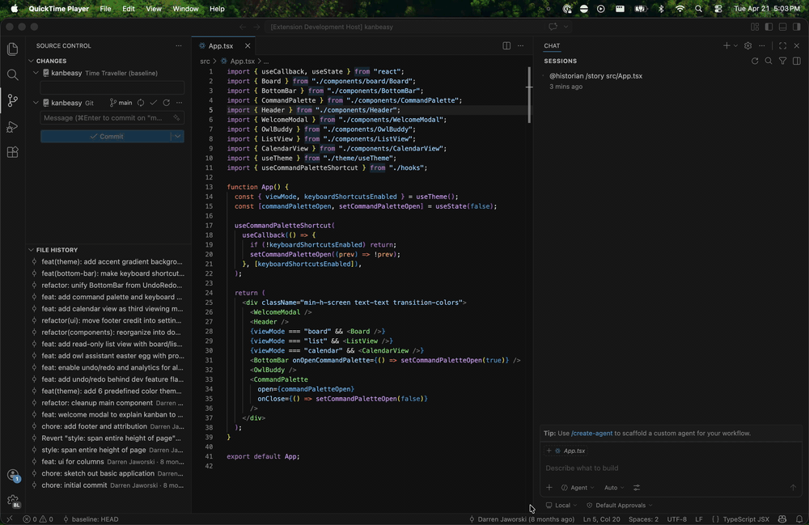
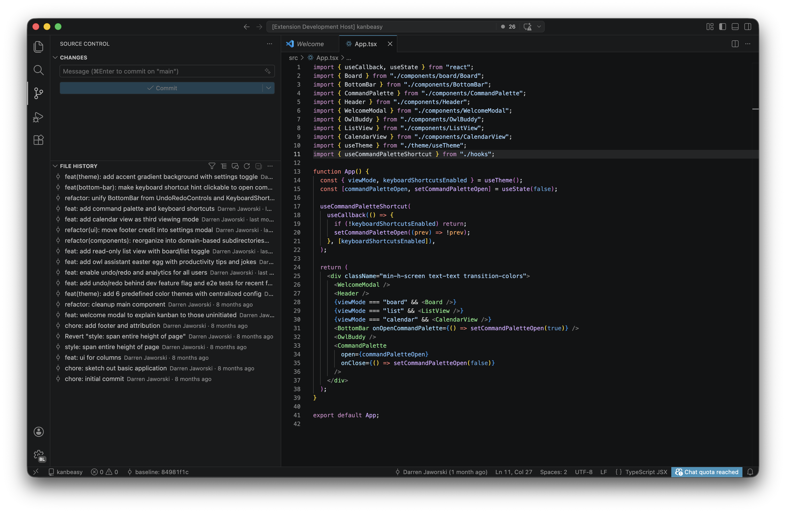
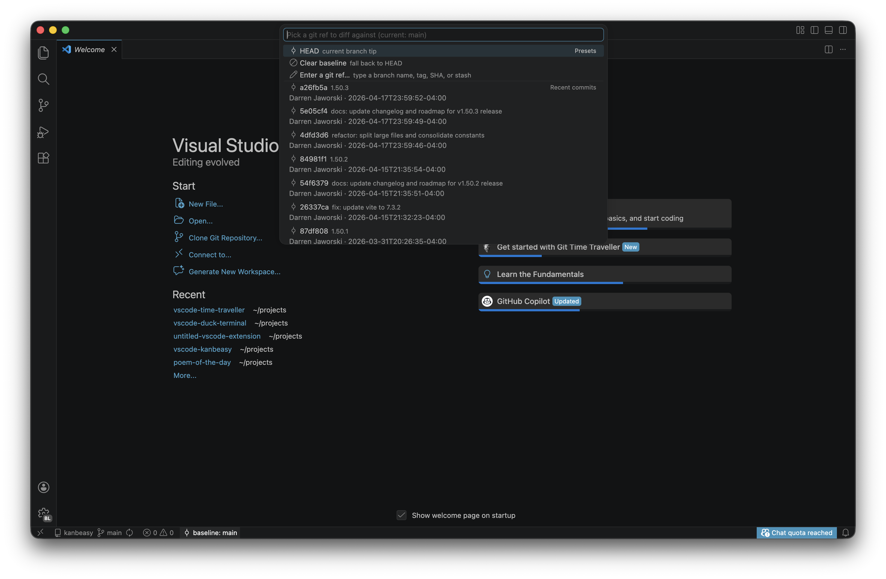
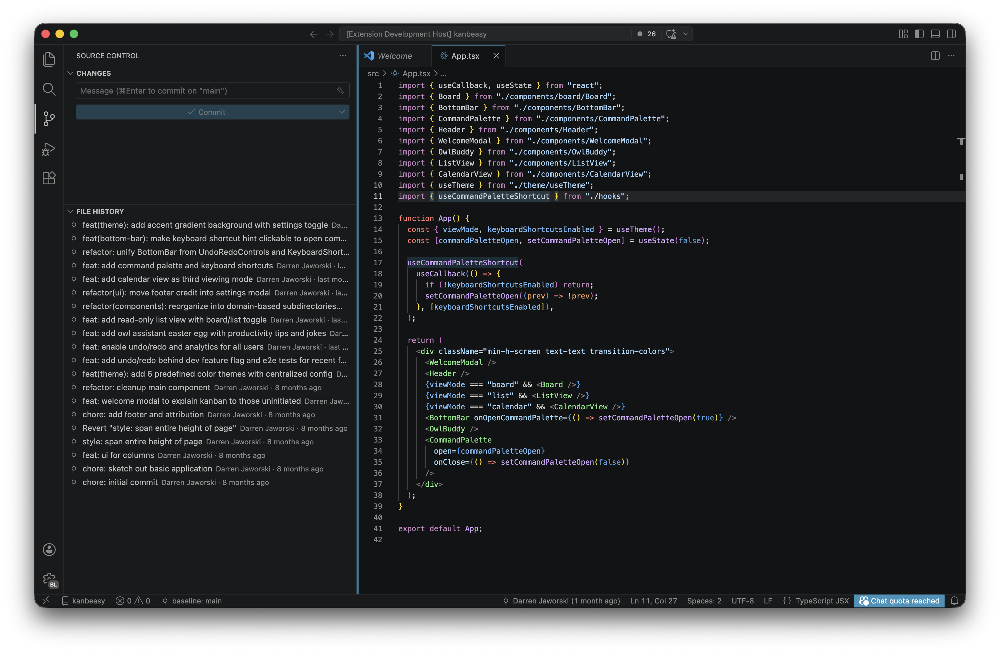

# Git Time Traveller

[](https://marketplace.visualstudio.com/items?itemName=DarrenJaworski.vscode-time-traveller)
[](https://marketplace.visualstudio.com/items?itemName=DarrenJaworski.vscode-time-traveller)

Ask **`@historian`** _why_ a line is the way it is — grounded in real commit history, not guesswork. Set any commit as your diff baseline and watch the gutter update live. Explore the story of a file — or any single commit — without leaving VS Code.

git-blame meets narrative history, in one extension.



---

## `@historian` — ask why

Open the chat panel, mention `@historian`, and ask in plain English. The participant shells out for `git blame`, `git log`, and `git show`, assembles structured evidence — including **trimmed patch excerpts**, **per-commit file stats**, and (for GitHub repos) **associated pull requests** — and streams a grounded explanation. Every cited commit becomes a clickable chip in the response.

```
@historian why is this written this way?
@historian /story
@historian /story abc1234       # commit-focused story: motivation + files + context
@historian /since main
@historian /author alice
```

**Slash commands:**

| Command             | What it does                                                                 |
| ------------------- | ---------------------------------------------------------------------------- |
| _(none / `/why`)_   | Explain the selected lines using blame + file log + scoped diff snippets     |
| `/story`            | Chronological narrative of how the whole file got here                       |
| `/story <sha>`      | Tell the story of a single commit: motivation, files touched, how it fits in |
| `/since <ref>`      | Focus on everything that landed in this file since `<ref>`                   |
| `/author <pattern>` | Filter to one author's commits on the file                                   |

**GitHub PR context** — when the repo has a GitHub remote, `@historian` looks up the PRs associated with cited commits and folds the PR title + body into the prompt. Signs in via VS Code's built-in GitHub auth **silently** — you're never prompted during a chat. Unauthenticated calls still work for public repos (rate-limited to 60/hr/IP). GitLab, Bitbucket, and Enterprise GitHub are not yet supported.

**From the File History panel** — every commit row has two chat-triggering actions:

- **Ask `@historian` about this commit** — focuses the question on that commit.
- **Tell the story of this commit** — prefills `@historian /story <sha>` for a commit-focused narrative.

The panel title bar also has a one-click **Ask `@historian` about this file** button for a full `/story` without typing.

> **Requires a language-model provider** (e.g. GitHub Copilot Chat). Without one, the participant falls back gracefully rather than erroring.

---

## Features

### Dynamic baseline diff

The gutter's modify/add/delete decorations normally show changes since `HEAD`. Swap that baseline to **any** git ref with one pick:

- current HEAD, or any branch, tag, or remote branch
- the last 30 commits on the current branch
- `merge-base HEAD main` (and `master` / `develop` / `trunk`, auto-detected local-first, falling back to `origin/<name>`) — the PR-review workflow
- the **last release tag** (newest stable semver; `v`-prefix tolerated, prereleases ignored)
- any stash (`stash@{N}` enumerated automatically)
- a SHA typed by hand

Two scopes: a workspace-wide baseline, and **per-file overrides** that shadow it. The status-bar item reflects the effective baseline and annotates `(file)` when an override is active.





### File history panel

A sidebar tree under the built-in **Source Control** view, backed by `git log --follow`. For the active file:

- subject, `<author> · <date>`, rich markdown tooltip (short SHA, email, ISO date, full body)
- icons distinguish regular commits, merges, the current baseline, and a synthetic "● Working tree" row when the file is dirty
- rename-following: every rename transition is annotated with "renamed from `<old path>`"
- **primary click** sets the commit as the per-file baseline — the gutter updates without reloading
- inline icons: compare with working tree, compare with previous revision, ask `@historian` about this commit
- context menu: set as baseline (per-file), set as workspace baseline, open at revision, copy SHA / subject, ask `@historian`, tell the story of this commit, **open on GitHub / GitLab / Bitbucket**

**Pagination, filters, and grouping** — the panel loads 50 commits at a time with a virtual **Load more…** row at the bottom. Filter and group from the title bar:

- **Filter by subject/body** (case-insensitive substring match)
- **Toggle hide merge commits**
- **Group by** None / By date (Today / Yesterday / This week / This month / This year / Older) / By author

Active filters show up in the view's description line; **Clear filters** only appears when something is active. State persists per-workspace — your filter survives window reloads.

An in-memory LRU cache keyed by `(repo, file, page)` makes repeat views instant; branch switches, HEAD moves, fetches, and merges invalidate the cache automatically via the built-in Git extension's state events.



### Inline UX

- **Hover on changed lines** shows the last-touching commit (subject · shortSha · author · date), scoped to lines that differ from the current baseline. Toggle via `timeTraveller.hover.enabled`.
- **CodeLens above each hunk** in the gutter diff: "Ask @historian why this changed". Clicking it selects the hunk's lines and opens the chat with `@historian why is this the way it is?`. Toggle via `timeTraveller.codeLens.enabled`.

### Stepping & diff

- **`Step Baseline Backward / Forward`** — walk ±1 commit along the file's log (writes to the per-file slot).
- **`Open Diff with Baseline`** — side-by-side editor using the effective baseline as the left side.

---

## Getting started

1. **Install** — from the [VS Code Marketplace](https://marketplace.visualstudio.com/items?itemName=DarrenJaworski.vscode-time-traveller), or `code --install-extension vscode-time-traveller-*.vsix`. A **"Get started with Git Time Traveller"** walkthrough opens automatically on first install and walks you through the four steps below.
2. **Ask `@historian`** — open the chat panel and type `@historian /story` on any tracked file for an instant narrative.
3. **Pick a baseline** — `Time Traveller: Pick Diff Baseline…` from the Command Palette. The gutter updates immediately.
4. **Browse history** — click the Source Control icon in the Activity Bar; the **File History** panel appears below the git views.
5. _(Optional)_ **Sign in to GitHub** — once, from any VS Code feature that prompts for GitHub auth — and `@historian` will start folding PR context into its answers on GitHub-backed repos.

Requires VS Code `^1.95.0` for the stable chat participant + `vscode.lm` APIs.

---

## Commands

Workspace-level commands (available in the Command Palette):

| Command                                             | What it does                                                                                                           |
| --------------------------------------------------- | ---------------------------------------------------------------------------------------------------------------------- |
| `Time Traveller: Pick Diff Baseline…`               | Sectioned picker: presets, scopes (merge-base, last release), branches, tags, remote branches, stashes, recent commits |
| `Time Traveller: Clear Diff Baseline`               | Fall back to HEAD workspace-wide                                                                                       |
| `Time Traveller: Pick Diff Baseline for This File…` | Same picker, file-scoped                                                                                               |
| `Time Traveller: Clear Per-File Baseline`           | Remove the override; global baseline takes effect again                                                                |
| `Time Traveller: Step Baseline Backward / Forward`  | ±1 commit along `git log --follow`                                                                                     |
| `Time Traveller: Open Diff with Baseline`           | Side-by-side diff editor                                                                                               |
| `Time Traveller: Show Current Baseline`             | Info message with the effective ref                                                                                    |
| `Time Traveller: Filter by subject/body…`           | Filter the File History panel                                                                                          |
| `Time Traveller: Toggle hide merge commits`         | In the File History panel                                                                                              |
| `Time Traveller: Group history by…`                 | None / By date / By author                                                                                             |
| `Time Traveller: Clear filters`                     | Reset filter + grouping state                                                                                          |

History-panel per-row actions aren't listed in the palette — they're only meaningful from the tree.

---

## Configuration

| Setting                                     | Default   | Description                                                                                                                     |
| ------------------------------------------- | --------- | ------------------------------------------------------------------------------------------------------------------------------- |
| `timeTraveller.defaultBaseline`             | `HEAD`    | Default git ref to diff against when no baseline is picked. Pin it to `origin/main` for a steady workspace-wide PR-review view. |
| `timeTraveller.codeLens.enabled`            | `true`    | Show the "Ask @historian" CodeLens above each changed hunk.                                                                     |
| `timeTraveller.hover.enabled`               | `true`    | Show the last-touching-commit hover on changed lines.                                                                           |
| `timeTraveller.chat.modelVendor`            | `copilot` | Preferred language-model vendor for `@historian`. Leave empty to accept any vendor.                                             |
| `timeTraveller.chat.modelFamily`            | `gpt-4o`  | Preferred model family, passed to `vscode.lm.selectChatModels`. Examples: `gpt-4o`, `claude-3.5-sonnet`. Empty = any.           |
| `timeTraveller.chat.maxBlameEvidenceTokens` | `4000`    | Soft cap on characters of patch/diff evidence per query. Lower it when hitting model context limits.                            |
| `timeTraveller.pr.enabled`                  | `true`    | Fetch GitHub PR context for cited commits. Disable to keep queries fully local.                                                 |

---

## How it works

- **`@historian`** builds its prompt from structured evidence — selection excerpt, blame-per-line rollup, referenced commits, file log, **trimmed patch excerpts** (`git show --patch` with char/line caps), **per-commit file stats** (`git show --numstat`), and **GitHub PR title + body** for cited commits — all assembled by pure helpers in `src/historian/` and `src/pr/`. The orchestrator streams the model response and emits `stream.reference(uri)` per cited commit. An in-memory PR cache keeps the GitHub API hits to a minimum (session-scoped, capped at 5 lookups per query).
- **Quick diff** is driven by a `QuickDiffProvider` registered against a custom `git-time-traveller:` URI scheme. Live-baseline URIs carry no query and resolve the ref against the baseline store at read time, so decorations refresh the moment the baseline changes.
- **File history** shells `git log --follow --pretty=<custom>` and parses renames via a pure helper. Paginated with an LRU cache keyed by `(repoRoot, relPath, limit)`, invalidated per-repo on `Repository.state.onDidChange`.

Prefer the built-in Git extension API for repo and ref enumeration; fall back to the `git` CLI where the API doesn't expose what we need (blame, merge-base, stash list, `--numstat`, `--patch`).

---

## Development

```bash
npm install
npm run watch       # incremental compile
# F5 in VS Code — launches the Extension Host with this extension loaded
npm run kitchen-sink  # format:check → lint → typecheck → test → compile → package
```

Tests use Vitest; the `vscode` module is aliased to a hand-rolled mock so pure logic is covered without booting VS Code. See [`CONTRIBUTING.md`](./CONTRIBUTING.md) for the manual test checklist.

Architecture, conventions, and testing guidance live in [`CLAUDE.md`](./CLAUDE.md). Phasing and in-flight work live in [`ROADMAP.md`](./ROADMAP.md).

---

## License

[MIT](./LICENSE)
